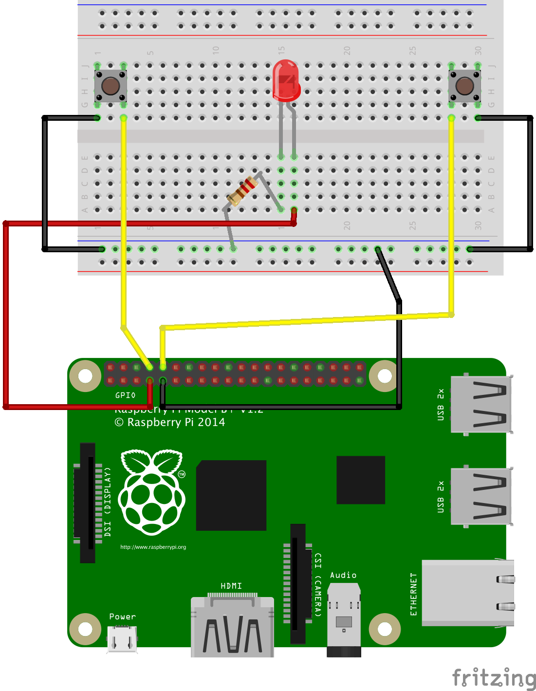

# GPIO

[The offical guide on using GPIO](http://www.raspberrypi.org/documentation/usage/gpio/)

[Article on example program](http://www.raspberrypi.org/learning/quick-reaction-game/worksheet/)

### Raspberry Pi GPIO pin layout

### Circuit diagram for example program
